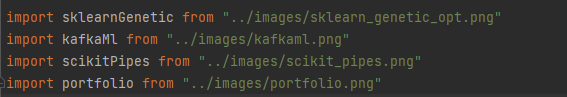

<h2>
  Personal Portfolio
  <a href="https://github.com/jayasri058/Portfolio.git" target="_blank">Website</a>
</h2>

This is my website to resume my work as a data scientist.
The page mainly uses React and MUI and is inspired by open-source components.

Feel free to use this project as a template, and please give a small credit by linking back to this project.
If you found this project helpful, consider giving it a 
[star](https://github.com/jayasri058/Portfolio/stargazers) [⭐](https://github.com/jayasri058/Portfolio/stargazers)

**[Live Demo](https://github.com/user-attachments/assets/20b9f7a9-dc4b-4017-b670-90d37a239ae4)**


## Installation Guide

* Fork the project 
  ```
  https://github.com/jayasri058/portfolio/fork
  ```
* Clone your fork
  ```
  git clone https://github.com/{yourusername}/portfolio.git
  ```
* Install the packages
  ```
  npm install
  ```
* Start the project
  ```
  npm start
  ```

## Customize your information

All the content (text, icons, links, etc.) are configured in the `assets` folders,
it has two kinds:

### Configs:

There is one configuration file per page or main component, for example, if you want
to modify the footer icons and hyperlinks, go to the footerConfig.js file

<a>
    
</a>

Here, you can modify all the values but keep the key's names, structure, and className the same; 
you can also add new values to the configs containing a list.


### Images:

This folder keeps images displayed over some routes, like blogs and projects.
For example, inside the projectsConfig.js file, the list of projects has a property called "image":


You can set any valid href for the `<a/>` tag as an image URL or, like in the above image, 
an image from the `assets/images` folder.




### Set Google Analytics track (Optional):

Take the `.env.example` file, put your tracking ID in the 
variable `REACT_APP_TRACKING_ID`, and rename the file to `.env`

## Troubleshooting

If you see any error of unexpected token ">" while deploying, try to remove the following from the `package.json` file:
```
"homepage": "https://jayasri058.github.io/Portfolio",
```
